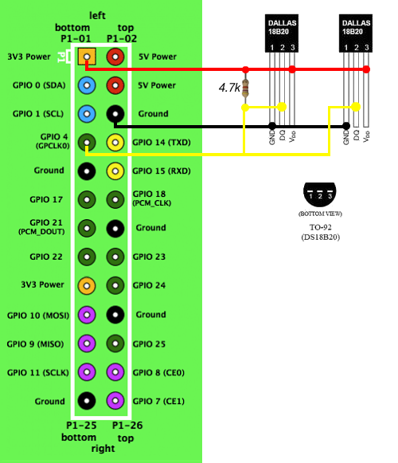

# temperature-logger

## Requirements
* InfluxDB-Python https://github.com/influxdata/influxdb-python
* schedule https://github.com/dbader/schedule
* W1ThermSensor https://github.com/timofurrer/w1thermsensor

## Wiring


## DS18B20 sensor settings

For the sensor temperature resolution setting you have to use a standard GPIO with a pull up resistor and only one sensor and type:

### On Raspberry Pi 1

(ignore any errors:)

```bash
$ wget https://raw.githubusercontent.com/blogmotion/BitBangingDS18B20/master/configDS18B20.c
$ gcc -o configDS18B20 configDS18B20.c
$ sudo ./configDS18B20
```

Now type 9,10,11, or 12 to change resolution:

* 9 bit : 0.5°c
* 10 bit : 0.25°c
* 11 bit : 0.125°c
* 12 bit : 0.0625°c

### On Raspberry Pi 2

(ignore any errors:)

```bash
$ wget https://raw.githubusercontent.com/blogmotion/BitBangingDS18B20/master/configDS18B20.c
$ sudo nano configDS18B20.c
```

Change BCM2708_PERI_BASE "0x20000000" to BCM2708_PERI_BASE "0x3F000000" (ignore any errors)
Save (Ctrl+X, Y, ENTER)

```bash
$ gcc -o configDS18B20 configDS18B20.c
$ sudo ./configDS18B20
```

Now type 9,10,11, or 12 to change resolution:

* 9 bit : 0.5°c
* 10 bit : 0.25°c
* 11 bit : 0.125°c
* 12 bit : 0.0625°c

## Usage

### Source
```bash
$ git clone https://github.com/jimrkh/temperature-logger.git ~/temperature-logger
```

### Virtualenv

```bash
$ virtualenv -p python3 ~/temperature-logger/env
$ source ~/temperature-logger/env/bin/activate
$ pip install -r ~/temperature-logger/requirements.txt
$ deactivate
```

### Supervisor

```bash
$ sudo ln -s ~/temperature-logger/supervisor-temperature.conf /etc/supervisor/conf.d/temperature-logger.conf
$ sudo ln -s ~/temperature-logger/supervisor-temperature-humidity-DHT.conf /etc/supervisor/conf.d/temperature-humidity-logger-DHT.conf
```
